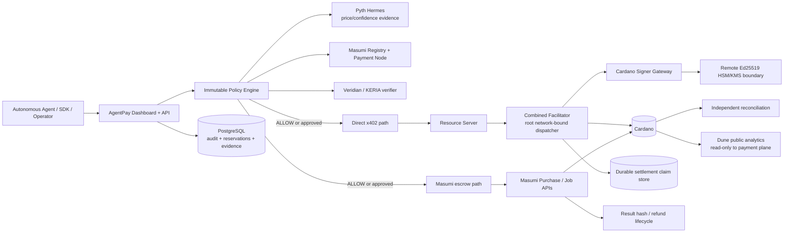

# AgentPay Catalyst submission package

This document is the reproducible product/demo narrative for the Cardano-focused AgentPay implementation. It deliberately separates **implemented source behavior** from **external launch evidence**. Do not replace missing canary, credential, deployment, custody, monitoring or audit evidence with screenshots or prose.

## One-line product

**AgentPay is a policy, trust and settlement control plane that lets autonomous software agents spend on Cardano without giving the agent unrestricted wallet authority.**

## Problem

Autonomous agents can discover services and initiate work, but production money movement needs controls that model/tool runtimes do not provide by themselves:

- deterministic spend limits and approvals
- strong seller/payee identity
- exact payment-resource binding and replay safety
- narrow signing authority rather than raw private keys in the application
- safe handling of ambiguous submissions
- escrow/refund/result-verification when direct payment is insufficient
- auditable public-chain evidence without publishing private prompts, organization data or credentials

## Solution

AgentPay places a deterministic policy and trust layer between an autonomous agent and payment execution. On Cardano it supports two separate settlement modes:

1. **Direct x402 `exact`.** A resource issues an exact Cardano requirement. AgentPay evaluates policy, creates/reserves spend, signs through an isolated gateway, independently verifies signed CBOR in the facilitator, submits, reconciles and only then reports settlement.
2. **Masumi escrow.** AgentPay verifies a Masumi resource identity/pricing surface, applies the same spending policy plus optional reputation and Veridian/KERI constraints, creates the escrow purchase, starts the job, reconciles lifecycle state, verifies result hash evidence and supports refund request/authorization.

Pyth can express policy ceilings in conservative USD values. Dune can publish aggregate/public settlement evidence, but Dune is never an authorization dependency.

## Architecture



## Security invariants demonstrated by the implementation

- The dashboard does not need a production Cardano private signing seed.
- Production signer configuration rejects `CARDANO_SIGNING_SEED_HEX`; signing is delegated to a separate Ed25519/HSM-style boundary.
- The remote signer receives only the transaction-body hash, not the transaction policy/context.
- The signer constructs a narrow phase-1 payment and the facilitator independently decodes/verifies it before submission.
- The Cardano payment requirement includes a SHA-256 binding of the canonical resource URL.
- Durable settlement binding includes the complete resource-bound requirement, payer and UTxO nonce.
- Same-resource retries are idempotent; a different resource gets a different binding even when price/payee match.
- An ambiguous submission does not automatically release reserved spend and is not blindly resubmitted.
- Pyth failure/staleness/confidence failure cannot relax a policy.
- Masumi direct-payee trust and Masumi escrow are distinct modes; direct x402 is not mislabeled as escrow.
- Settlement-derived reputation counts only AgentPay-observed terminal escrow outcomes, with completed reputation requiring a verified result hash.
- KERI/ACDC cryptography is verified by the configured KERIA authority; AgentPay narrows that trust with issuer/schema/identity/freshness rules.
- Dune receives only public-chain observability inputs and cannot approve or settle a payment.

## Demo prerequisites

Before recording a demo as a live-production proof, record the exact release SHA and provide the corresponding evidence in the Catalyst release-evidence store/readiness surface. The minimum Cardano Preprod path is:

1. exact dashboard release SHA successfully built and deployed;
2. Render signer/facilitator/resource-server services deployed over HTTPS;
3. funded Cardano Preprod payer with ADA-only UTxOs for the ADA demo;
4. reviewed remote Ed25519 signer/custody endpoint and public key;
5. real Blockfrost project credential;
6. real Pyth feed configuration if Pyth is shown;
7. real Masumi registry/payment-node configuration if Masumi is shown;
8. real KERIA verifier + trusted issuer/schema configuration if KERI is shown;
9. a low-value successful Preprod settlement independently verified on-chain;
10. if escrow is shown, a completed Masumi escrow with verified result hash and a separate refund drill;
11. if Dune is shown, published query/dashboard IDs plus a sample transaction cross-check;
12. monitoring/on-call, database restore evidence and independent security evidence for any claim of production launch.

A synthetic resource-server payload is valid for demonstrating payment plumbing, but the narration must call it a synthetic fixture rather than live market/research/model data.

## Demo script

### Scene 1 — Controlled agent

Open an active Cardano Preprod agent. Show its payment account/network and published policy. Explain that the agent can request spend but cannot override the immutable policy or obtain the production private signing key.

### Scene 2 — Publish a restrictive policy

Publish a new policy version with:

- a small atomic per-transaction and daily limit;
- optional hourly/monthly/velocity/cooldown constraints;
- a merchant or category rule;
- Pyth USD ceiling, when a real feed is configured;
- Masumi verified identity requirement;
- a minimum verified-completion history/reputation threshold when real escrow history exists;
- Veridian/KERI issuer/schema/freshness constraints when a real credential is configured.

Show the newly published version and explain that selected extensions are attached before the version becomes active.

### Scene 3 — Verify the seller

On the resource detail page:

1. refresh/bind the Masumi identity;
2. show exact agent identifier, capability and settlement wallet evidence;
3. if KERI is part of the demo, verify and bind the real ACDC credential through KERIA;
4. show issuer/schema/subject/freshness evidence without exposing credentials or secrets beyond what is safe for the demo.

### Scene 4A — Direct x402

Send a low-value direct x402 request to a registered Cardano resource.

Narrate the sequence:

1. resource returns exact x402 requirements containing the resource binding;
2. AgentPay evaluates policy and reserves spend;
3. signer gateway builds the Cardano transaction;
4. remote custody signs only the body hash;
5. facilitator independently verifies CBOR/witness/payer/payee/amount/asset/change/TTL/fee/nonce;
6. durable claim prevents replay/resubmission ambiguity;
7. facilitator submits;
8. AgentPay reconciles independent chain evidence;
9. transaction detail links to the Cardano explorer.

If the request exceeds policy, demonstrate DENY or REQUIRE_APPROVAL rather than changing the policy to make the demo pass.

### Scene 4B — Masumi escrow

Choose a verified Masumi resource, provide bounded JSON job input and start the escrow purchase.

Show lifecycle transitions as real evidence becomes available:

`PREPARED → FundsLockingRequested → FundsLocked → ResultSubmitted → Completed`

At completion, show that the result hash is verified before the outcome contributes to completed reputation.

For the refund drill, use a separate eligible low-value purchase:

`FundsLocked/ResultSubmitted → RefundRequested → RefundAuthorized`

The buyer requests the refund; the seller/provider workspace authorizes it. Do not simulate a refund by editing local state.

### Scene 5 — Public evidence

Open the chain explorer for the demo transaction. If Dune publication evidence exists, open the public dashboard and cross-check the same transaction/sample against the query output.

Explain that Dune contains public-chain settlement facts only and no private prompts, organization policy, credential material or hidden agent input.

### Scene 6 — Failure safety

Demonstrate one fail-closed case, for example:

- stale/uncertain Pyth observation;
- below-threshold Masumi reputation;
- missing/stale KERI credential;
- policy limit exceeded;
- emergency stop enabled.

The desired result is a blocked new side effect with an auditable reason—not a successful payment.

## Suggested 60-second pitch

AgentPay gives autonomous agents a controlled way to spend on Cardano. Instead of handing an AI agent an unrestricted wallet, we put deterministic policy, approvals, identity and independent settlement verification in front of every payment. Direct x402 payments are cryptographically bound to the exact paid resource, signed through an isolated custody boundary and reconciled from chain evidence. For jobs that need stronger buyer protection, the same agent can use Masumi escrow with result-hash verification, refunds and settlement-derived seller reputation. Pyth lets policy stay meaningful in USD while Cardano settles the transaction, Veridian/KERI can strengthen seller identity, and Dune exposes public settlement evidence without putting private agent data on-chain. The result is a payment control plane designed for agents that can act autonomously without receiving unlimited financial authority.

## Landing-page copy

### Hero

**Autonomous agents can spend. They should not control the treasury.**

AgentPay applies immutable spend policy, approvals, verified counterparties, isolated signing and independent settlement evidence to agent payments across Cardano and other configured rails.

Primary CTA: **Open AgentPay**
Secondary CTA: **View payment architecture**

### Cardano section

**Cardano-native agent payments with exact resource binding.**

Every Cardano x402 payment is tied to the resource being purchased, verified before submission and reconciled from independent chain evidence. ADA is supported directly; explicitly configured native-token support is constrained by exact asset and conservation rules.

### Trust section

**Price, identity and reputation can tighten policy—not bypass it.**

Pyth provides conservative USD valuation. Masumi verifies seller discovery/payment facts and supports escrow, result verification and refunds. Veridian/KERI can require a cryptographically verified identity credential. If required evidence is missing, stale or inconsistent, AgentPay denies the new spend.

### Evidence section

**Public settlement evidence without public private data.**

Cardano explorer links and optional Dune analytics expose public transaction facts. Prompts, job input, organization policy, user data and signing secrets stay out of public analytics.

## Metrics to report without fabrication

Report only values produced by actual stored evidence for the release/demo period. Useful measures include:

- total payment intents by terminal status;
- direct Cardano x402 settled / denied / approval-required / submission-unknown counts;
- Cardano settlement confirmation latency where timestamps are recorded;
- Masumi escrow completed-with-verified-result count;
- Masumi refund-authorized and disputed counts;
- seller reputation observation count and computed score;
- policy denial reason distribution;
- approval decision count and time-to-decision where timestamps permit;
- number of published Dune sample transactions successfully cross-checked;
- canary pass/fail evidence by rail and immutable release SHA.

Do not invent TPS, customer counts, volume, savings, accuracy, uptime, adoption or revenue numbers from demo fixtures.

## Dune publication

The repository includes reproducible SQL and publishing scripts. With real write credentials/query IDs:

```bash
cd analytics/dune
node publish.mjs
node publish-dashboard.mjs
```

Record the resulting query/dashboard identifiers in release evidence, then independently verify at least one known Cardano settlement against the public query result before describing the dashboard as validated.

## Production-readiness statement for submission

A safe submission statement is:

> AgentPay implements the complete source architecture for policy-controlled Cardano x402 payments, isolated signing, Pyth-valued limits, Masumi escrow/refunds/reputation, optional Veridian/KERI identity and Dune observability. Production enablement remains fail-closed until the exact release SHA passes repository/deployment checks and the applicable external credentials, funded canaries, custody review, monitoring, restore drill and independent security evidence are recorded.

Do not shorten this to “production ready” unless those external gates are actually satisfied for the release being demonstrated.
