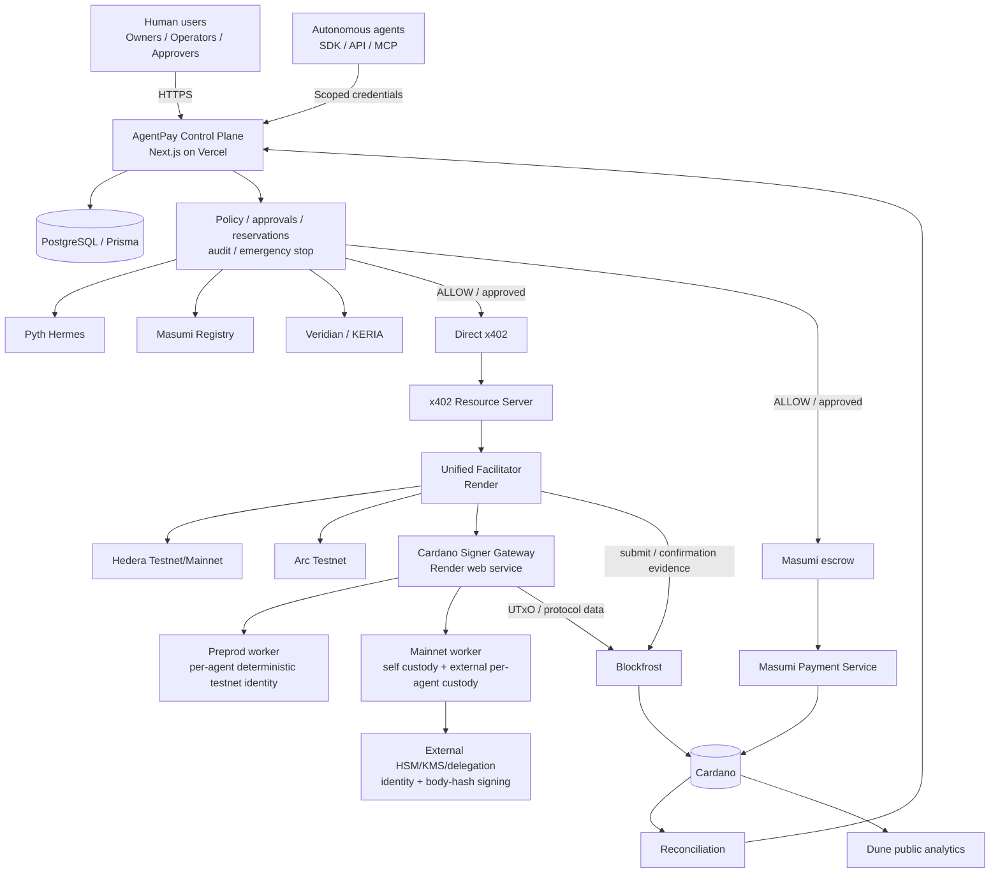

# AgentPay Catalyst Architecture

**Updated:** 2026-08-22  
**Primary builder:** Daniel Praise (`Daniel419797`)

> **Reason for update:** This architecture now mirrors the implemented code rather than the earlier Mainnet self-custody-only state. It also corrects component responsibilities: policy/reservations live in the control plane, the Cardano signer constructs/signs, the facilitator independently verifies/submits/confirms, and external Mainnet custody holds the per-agent private keys.

## Product boundary

AgentPay is the policy, treasury and settlement-control layer for autonomous software agents. It composes existing ecosystem primitives rather than claiming to replace them.

## Current architecture



## Control plane responsibilities

The Vercel application owns:

- authentication/tenancy/RBAC;
- agent and payment-account lifecycle;
- scoped agent credentials;
- immutable financial policy;
- approvals;
- spend reservations/idempotency;
- Pyth/Masumi/KERI trust composition;
- payment intent/attempt state;
- audit/incidents/reconciliation;
- emergency stop and operational controls.

The control plane does not hold Cardano private keys.

## Direct x402 boundary

The x402 Resource Server issues the payment requirement and, after receiving the payment payload, uses the facilitator protocol to verify/settle before returning paid content.

For Cardano, the requirement is bound to the canonical resource URL and exact network/payee/asset/amount.

## Masumi boundary

Masumi has two distinct roles:

- registry/counterparty trust may constrain direct x402;
- Masumi Payment Service provides the separate escrow/job/refund/result lifecycle.

Direct x402 is not labeled as escrow.

## Unified facilitator boundary

The Render facilitator contains child rails for:

- Hedera Testnet;
- Hedera Mainnet;
- Arc Testnet;
- Cardano Preprod;
- Cardano Mainnet.

For Cardano it independently verifies the final signed transaction, manages replay/settlement claims, submits via Blockfrost and reconciles confirmation evidence. It does not possess the Cardano payer private key.

## Cardano signer boundary

The signer is a separate Render web-service gateway with isolated Preprod/Mainnet workers.

### Preprod

Per-agent Ed25519 test identities are deterministically derived inside the signer from a testnet-only master secret.

### Mainnet

Two modes coexist:

- self custody: return the exact unsigned transaction for external wallet signing;
- external per-agent managed custody: resolve a distinct Ed25519 public key/signer reference for the immutable Agent ID, derive the payer address locally, sign only the transaction-body hash through the external provider, then verify the returned signature locally.

There is no Mainnet managed-agent master key or deployment-wide autonomous-agent payer.

## External custody trust boundary

The external HSM/KMS/delegation provider is not hosted by AgentPay and retains the Mainnet private keys.

Bounded contract:

```text
POST /identity
POST /sign
```

A provider failure or identity/signature mismatch fails closed and cannot fall back to another agent/shared key.

## Blockfrost boundary

Blockfrost serves different code paths:

- signer: UTxOs/protocol data for transaction construction;
- facilitator: Cardano submission and independent transaction/latest-block confirmation evidence.

It is not a policy authority.

## Public/private observability split

Dune is public, read-only chain analytics. Private tenant identities, prompts, organization policy, credentials and resource contents remain in AgentPay's private control-plane data.

## Architecture invariants

- one managed payment identity per agent;
- no Cardano Mainnet shared master key;
- private Mainnet agent keys remain outside AgentPay;
- policy/approval before signing;
- body-hash-only external Mainnet signing;
- local signature verification;
- independent facilitator transaction verification;
- facilitator, not signer, submits Cardano transactions;
- ambiguous submission is reconciled rather than blindly retried;
- required Pyth/Masumi/KERI evidence may tighten policy but not silently weaken it.

## Provenance

I am **Daniel Praise** (`Daniel419797`), the repository owner and primary technical contributor. I originally built AgentPay for the Hedera x402 bounty and then extended it to this multi-rail architecture. This diagram/document is updated specifically to match the implementation merged on 2026-08-22.