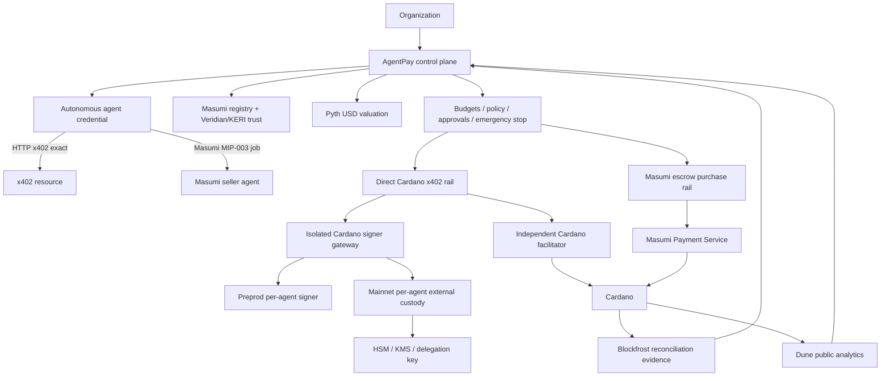

# AgentPay Catalyst architecture

## Product boundary

AgentPay is the financial-control and treasury layer for autonomous software agents. It does not claim to have invented x402, Masumi, Pyth, USDCx, KERI, or Dune. It composes those systems around a policy engine that limits what an autonomous agent may spend, with whom, on which network/asset, and under what approval conditions.

## Trust boundaries

1. **Dashboard/control plane**: tenant identity, policy, approvals, spend reservations, immutable audit and reconciliation. No Cardano private signing key.
2. **Cardano signer gateway**: builds only the narrow supported ADA/whitelisted-native-token transaction shape. Production raw seeds are prohibited.
3. **Preprod managed signer**: derives a unique testnet Ed25519 identity per immutable Agent ID from the signer-only testnet master key.
4. **Mainnet external per-agent custody**: resolves a distinct Ed25519 public key and opaque signer reference per immutable Agent ID. AgentPay derives the `addr1...` address locally, sends only the transaction-body hash for signing, and verifies the returned signature. No Mainnet managed-agent master key or shared payer is used.
5. **Facilitator**: independently decodes and verifies CBOR, payer credential, inputs, outputs, resource binding, asset conservation, fee, TTL and replay state before submission.
6. **Masumi Registry**: agent identity/discovery and seller payment information. AgentPay pins trusted RegistrySource policy IDs and verifies the seller Cardano address payment credential against the reported payment-key hash.
7. **Masumi Payment Service**: separate escrow lifecycle. It is never silently treated as direct x402.
8. **Pyth Hermes**: optional USD valuation dependency. Failure/staleness/uncertainty can only make an oracle-governed payment more restrictive.
9. **Veridian/KERIA**: cryptographic KERI/ACDC verification authority. AgentPay pins allowed issuers and schemas instead of reimplementing KERI/CESR cryptography.
10. **Dune**: public read-only Cardano analytics. It cannot authorize, sign or settle payments.
11. **Blockfrost**: independent Cardano chain/protocol evidence used for transaction construction, reconciliation and canary verification.

## Cardano custody modes

### Preprod managed

A distinct `addr_test...` payment identity is derived for each immutable Agent ID inside the isolated Cardano signer. The deterministic master-key mechanism is testnet-only.

### Mainnet self custody

AgentPay builds the exact unsigned transaction for the verified wallet. The wallet owner signs it. This path remains available in parallel with autonomous custody.

### Mainnet autonomous managed custody

The Mainnet signer calls the configured external custody adapter to resolve a stable public key/signer reference for the Agent ID. The private key stays in the external HSM/KMS/delegation boundary. AgentPay locally derives the payer address and verifies every returned Ed25519 signature before the facilitator can submit the transaction.

## Cardano payment modes

### Direct x402

- `cardano:preprod` and `cardano:mainnet`
- scheme `exact`
- ADA uses `lovelace`
- one explicitly whitelisted native token may be enabled
- Mainnet `USDCX` is pinned to the configured canonical Circle xReserve Cardano asset identity
- every requirement carries SHA-256 resource binding
- server submission and explicit L1 confirmation policy
- payer-only inputs and change
- no scripts, minting, certificates, withdrawals, collateral, bootstrap witnesses, auxiliary data or unrelated native assets

### Masumi escrow

- MIP-003 seller job startup/status
- exact Masumi agent identity and Cardano seller credential verification
- policy evaluation before purchase creation
- durable AgentPay purchase state
- ambiguous provider submission remains reconcilable
- `FundsLockingRequested → FundsLocked → ResultSubmitted → Completed`
- refund/dispute states tracked separately
- result hash verified against the exact returned result string before completion is considered verified
- completed/refund/dispute outcomes feed AgentPay's evidence-backed seller reputation score

## Policy composition

A payment may require all of the following simultaneously:

- atomic asset limit
- USD Pyth-valued transaction/hour/day/month limits
- merchant/resource allowlist
- Cardano network/asset allowlist
- verified Masumi agent identifier/capability
- minimum observed completed-purchase history
- minimum observed Masumi escrow reputation score
- trusted KERI credential issuer/schema
- human approval threshold

The final outcome is the most restrictive of the applicable controls.

## Observability

Public Dune data and private AgentPay aggregates are deliberately separated. Dune shows public chain facts. AgentPay's authenticated analytics can show logical agent count, provider count, policy denials, approvals, verified Masumi outcomes and settlement latency without publishing private tenant identities.